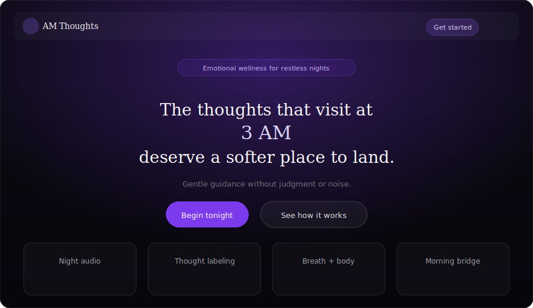

<p align="center">
  
</p>

<h1 align="center">3 AM Thoughts</h1>

<p align="center">
  <strong>Emotional wellness for the hours when everything feels louder than it should.</strong>
</p>

<p align="center">
  A calm, dark-aesthetic landing experience paired with an AI companion API for heartbreak, loneliness, and late-night emotional spirals.
</p>

<p align="center">
  
  
  
  
  
</p>

---

## Preview

<p align="center">
  
</p>

<p align="center"><em>Landing page mockup — dark theme, purple glow, Apple × Calm × Headspace inspired UX</em></p>

---

## What it does

**3 AM Thoughts** is an emotional wellness startup concept with two parts:

| Layer | Role |
|-------|------|
| **Frontend** | Marketing landing page with hero, features, community message, recovery routines, and waitlist CTA |
| **Backend** | FastAPI service with a `/chat` endpoint powered by OpenAI, tuned for empathetic late-night support |

The AI is instructed to stay warm and grounded—helping users calm spirals, avoid impulsive decisions, and build healthy routines without fostering dependency.

---

## Architecture

<p align="center">
  
</p>

```
Browser (Next.js :3000)
    →  POST /chat  →  FastAPI (:8000)
                          →  OpenAI (gpt-4o-mini)
```

---

## Project structure

```
3AM_thoughts/
├── frontend/                 # Next.js app
│   ├── app/                  # App Router pages & layout
│   ├── components/
│   │   └── LandingPage.tsx   # Main landing UI
│   └── public/
├── backend/                  # FastAPI app
│   ├── app/
│   │   ├── main.py           # App entry + CORS
│   │   ├── routes/
│   │   │   └── chat.py       # POST /chat
│   │   └── services/
│   │       └── openai_service.py
│   ├── .env.example          # Template (safe to commit)
│   └── venv/                 # Local Python env (gitignored)
├── docs/images/              # README assets (SVG)
└── .gitignore
```

---

## Getting started

### Prerequisites

- **Node.js** 20+ and npm
- **Python** 3.12+ (3.14 tested)
- **OpenAI API key** with available quota

### 1. Clone the repository

```bash
git clone https://github.com/YOUR_USERNAME/3AM_thoughts.git
cd 3AM_thoughts
```

### 2. Backend setup

```bash
cd backend

# Create & activate virtual environment (Windows PowerShell)
python -m venv venv
.\venv\Scripts\Activate.ps1

# Install dependencies
pip install fastapi uvicorn openai python-dotenv

# Configure secrets
copy .env.example .env
# Edit .env and set OPENAI_API_KEY=sk-...

# Run API server (from backend/, not backend/app/)
uvicorn app.main:app --reload
```

| URL | Description |
|-----|-------------|
| http://127.0.0.1:8000 | Health check |
| http://127.0.0.1:8000/docs | Swagger UI |
| http://127.0.0.1:8000/redoc | ReDoc |

**Test the chat endpoint:**

```bash
curl -X POST http://127.0.0.1:8000/chat \
  -H "Content-Type: application/json" \
  -d "{\"message\": \"I can't stop thinking about them tonight.\"}"
```

Expected response shape:

```json
{
  "reply": "..."
}
```

> **Tip:** If `uvicorn` is not found, activate the venv first or run `.\venv\Scripts\uvicorn.exe app.main:app --reload`.

### 3. Frontend setup

Open a **second terminal**:

```bash
cd frontend
npm install
npm run dev
```

Open http://localhost:3000 for the landing page.

---

## Environment variables

| Variable | Location | Required | Description |
|----------|----------|----------|-------------|
| `OPENAI_API_KEY` | `backend/.env` | Yes | OpenAI API key for chat completions |

Never commit `.env`. Use `backend/.env.example` as a template.

---

## API reference

### `GET /`

Health check.

```json
{ "message": "3 AM Thoughts Backend Running" }
```

### `POST /chat`

| Field | Type | Description |
|-------|------|-------------|
| `message` | `string` | User message |

**Example request:**

```json
{ "message": "I feel alone at 3 AM" }
```

**Example response:**

```json
{ "reply": "..." }
```

---

## Tech stack

### Frontend

- [Next.js 16](https://nextjs.org/) (App Router)
- [React 19](https://react.dev/)
- [Tailwind CSS 4](https://tailwindcss.com/)
- [Framer Motion](https://www.framer.com/motion/)
- Fraunces + DM Sans typography

### Backend

- [FastAPI](https://fastapi.tiangolo.com/)
- [Uvicorn](https://www.uvicorn.org/)
- [OpenAI Python SDK](https://github.com/openai/openai-python)
- [python-dotenv](https://github.com/theskumar/python-dotenv)

---

## Design principles

- **Dark & calming** — deep backgrounds, soft purple glow accents
- **Emotion-first copy** — meets users in vulnerable hours without toxic positivity
- **Mobile responsive** — layouts adapt from phone to desktop
- **Accessible motion** — respects `prefers-reduced-motion` where implemented

---

## Security notes

- `.env`, `venv/`, `node_modules/`, and `__pycache__/` are gitignored
- Rotate your API key if it was ever exposed
- CORS is currently open (`*`) for local development—tighten before production

---

## Roadmap

- [ ] Connect landing waitlist form to backend
- [ ] Wire frontend chat UI to `POST /chat`
- [ ] Add `requirements.txt` for reproducible Python installs
- [ ] Production deployment (Vercel + Railway/Render/Fly)
- [ ] Rate limiting and auth for chat endpoint

---

## Contributing

1. Fork the repo
2. Create a feature branch (`git checkout -b feature/your-feature`)
3. Commit changes (never include `.env` or secrets)
4. Open a pull request

---

## License

This project is currently unlicensed. Add a `LICENSE` file before public distribution.

---

<p align="center">
  <sub>Built for the quiet hours. You are not alone at 3 AM.</sub>
</p>
